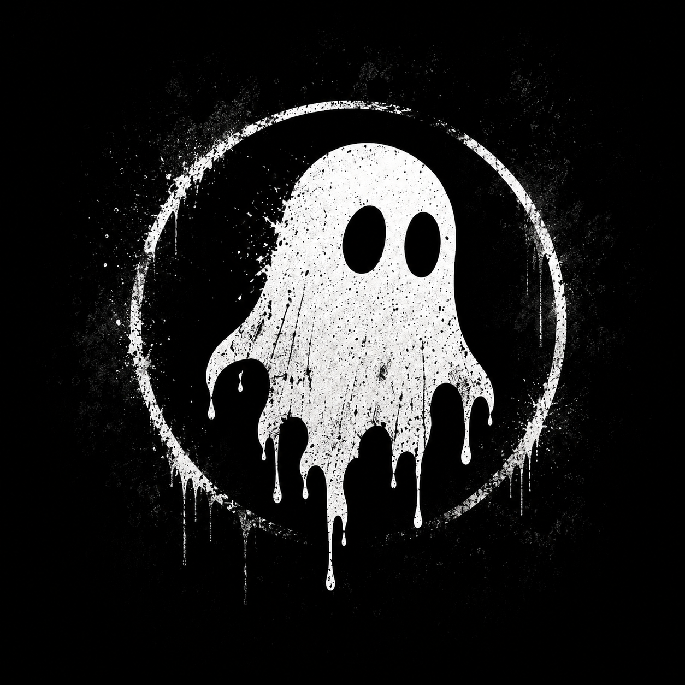
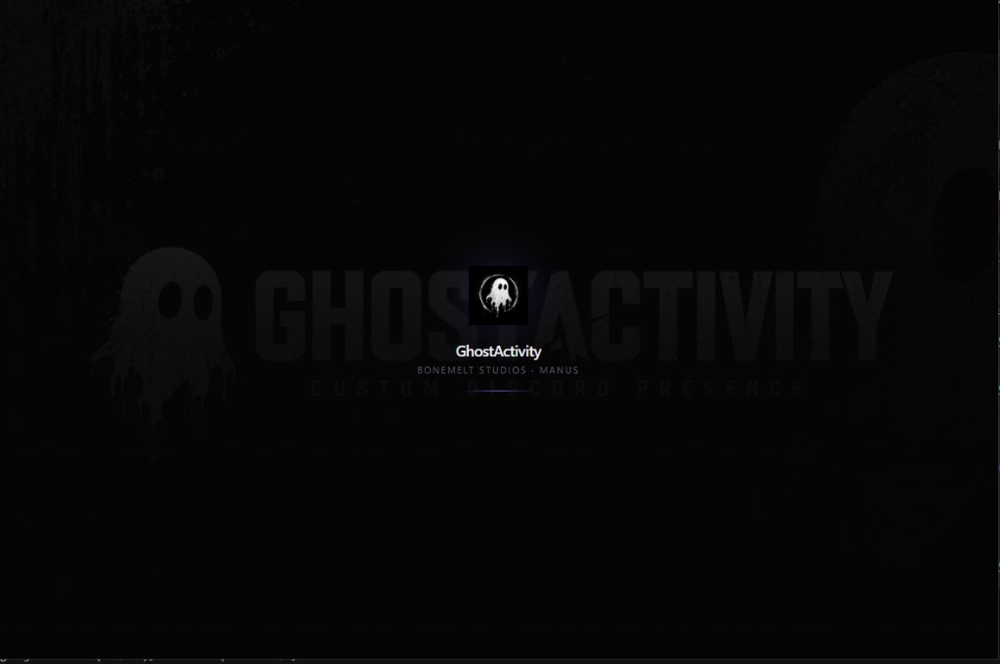
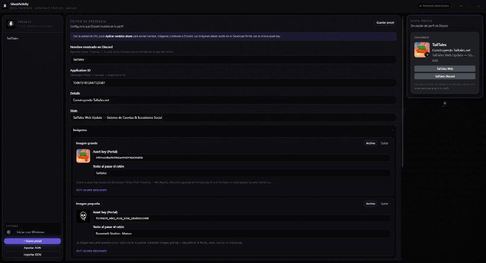
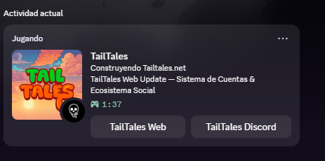
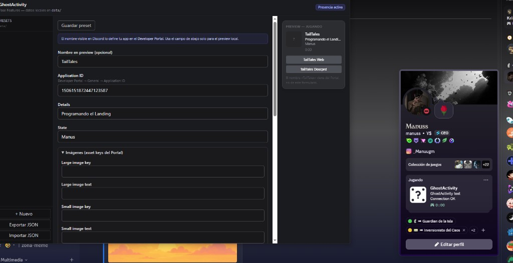
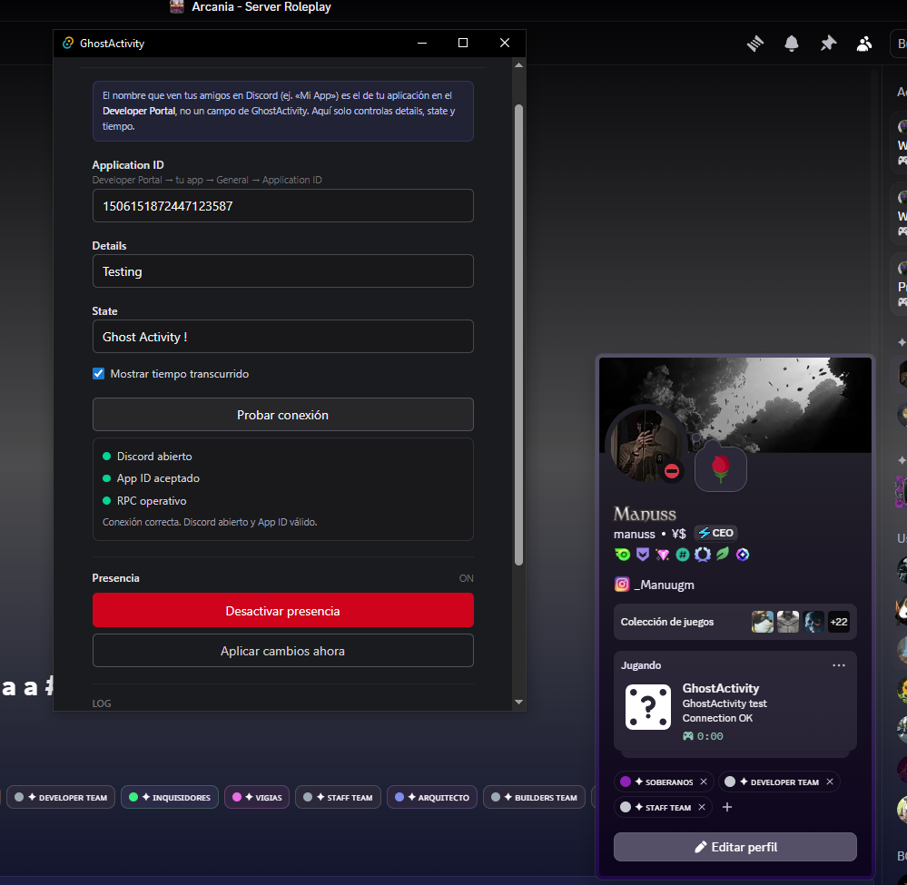
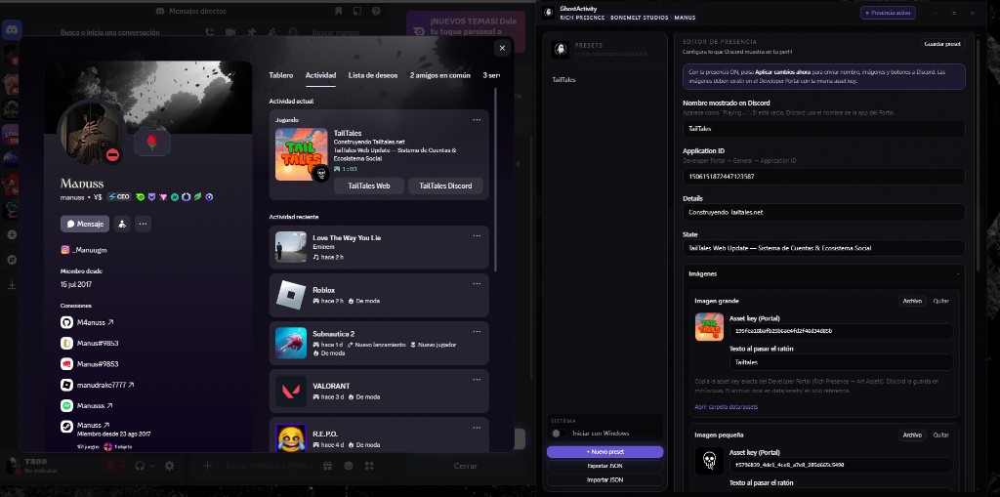
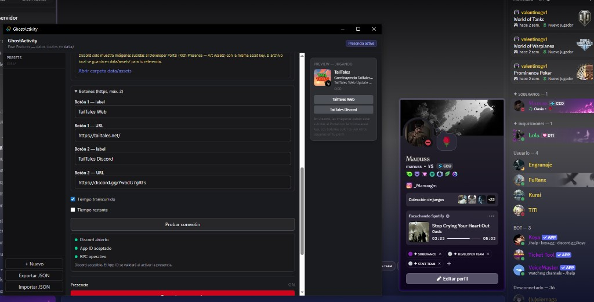
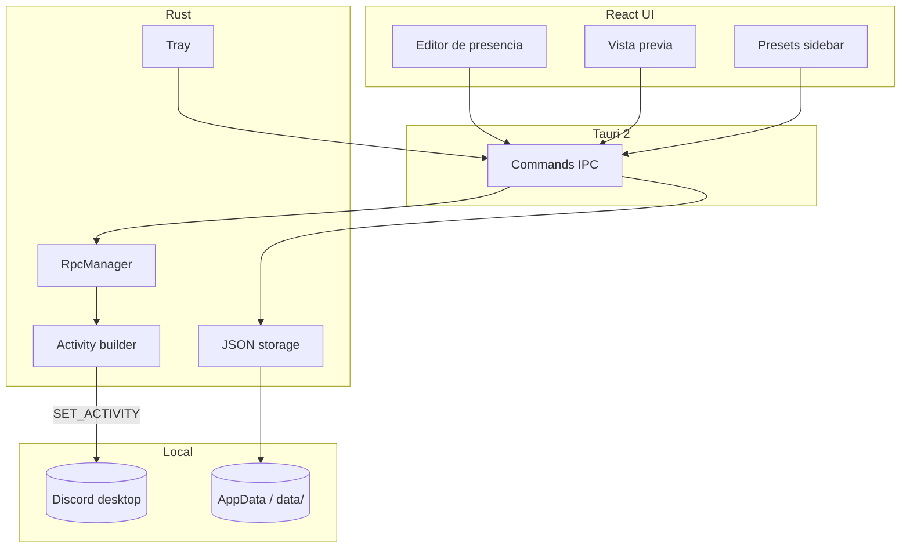

# GhostActivity

### Rich Presence para Discord, hecha como software de escritorio premium.

**Controla lo que el mundo ve en tu perfil — sin juegos abiertos, sin trucos, sin ruido.**

 

 

<i>Interfaz oscura · violeta frío · estética Bonemelt Studios</i>

 

[**⬇ Descargar GhostActivity_Setup.exe**](https://github.com/M4anuss/GhostActivity-Releases/releases/latest) · [Reportar un problema](https://github.com/M4anuss/GhostActivity-Releases/issues) · [Licencia MIT](LICENSE)

---

## ¿Qué es GhostActivity?

**GhostActivity** es una aplicación de escritorio para **Windows** que te permite **crear, previsualizar y controlar** una actividad de **Discord Rich Presence** personalizada — la misma capa que usan los juegos, pero bajo tu control.

No es un selfbot. No pide tu token. No toca la API privada de Discord.  
Habla con el **cliente de Discord en tu PC** mediante **RPC oficial**, igual que un juego legítimo.

> *Discord si Bonemelt Studios diseñara una herramienta de presencia para creadores, devs y jugadores.*

<table>
<tr>
<td width="33%" align="center">

**Legítimo**

RPC nativo vía IPC local

</td>
<td width="33%" align="center">

**Local**

Tus presets viven en tu máquina

</td>
<td width="33%" align="center">

**Premium**

UI de tres paneles, tray, motion

</td>
</tr>
</table>

---

## Características

| | |
|:---|:---|
| 🎭 | **Rich Presence personalizada** — details, state, nombre visible, tiempos |
| 👁️ | **Vista previa en vivo** — simula el bloque «Jugando» antes de publicar |
| 📁 | **Sistema de presets** — guardar, duplicar, importar/exportar JSON |
| 🔌 | **Test de conexión** — Discord abierto, App ID y RPC en un clic |
| 🖼️ | **Imágenes grande/pequeña** — asset keys del Developer Portal |
| 🔗 | **Botones** (hasta 2) — enlaces HTTPS en el perfil (visibles para otros) |
| 🔔 | **Bandeja del sistema** — minimizar sin perder la presencia |
| 🚀 | **Inicio con Windows** — opcional en el instalador y en la app |
| 🪶 | **Ligera** — Tauri 2 + Rust; sin Electron pesado |
| 🎨 | **UI Bonemelt** — oscura, industrial, violeta frío, mascota fantasma |

<strong>Ver detalles técnicos de cada función</strong>

 

- **Editor de presencia** — Application ID, nombre mostrado, details, state, timestamps.
- **Aplicar cambios ahora** — envía al instante mientras la presencia está activa.
- **Presets semilla** — Coding, Gaming, TailTales Dev, y más al primer arranque.
- **Datos en AppData** — `%APPDATA%\com.ghostactivity.app\data\`.
- **Ventana frameless** — barra superior custom, controles nativos, sombras cinematográficas.
- **Splash & motion** — Framer Motion, sensación de software comercial.

---

## Capturas

<table>
<tr>
<td width="50%" align="center">

 <b>Panel principal</b> — editor 3 columnas, presets y vista previa en vivo
</td>
<td width="50%" align="center">

 <b>En Discord</b> — Rich Presence real con assets, timer y botones
</td>
</tr>
<tr>
<td width="50%" align="center">

 <b>Presets</b> — biblioteca local, guardar y export/import JSON
</td>
<td width="50%" align="center">

 <b>Conexión</b> — App ID → Probar → Activar presencia
</td>
</tr>
<tr>
<td colspan="2" align="center">

 <b>En acción</b> — lo que configuras en la app es lo que ve tu perfil en Discord
</td>
</tr>
<tr>
<td colspan="2" align="center">

 <b>RPC avanzado</b> — botones, timestamps, prueba de conexión y toggle de presencia
</td>
</tr>
</table>

---

## Stack

<table>
<tr>
<th align="left">Capa</th>
<th align="left">Tecnología</th>
<th align="left">Rol</th>
</tr>
<tr>
<td><b>Shell</b></td>
<td> </td>
<td>Ventana nativa, tray, IPC, persistencia</td>
</tr>
<tr>
<td><b>UI</b></td>
<td>   </td>
<td>Layout 3 paneles, motion, design tokens</td>
</tr>
<tr>
<td><b>RPC</b></td>
<td></td>
<td>Presencia legítima vía pipe local</td>
</tr>
<tr>
<td><b>Datos</b></td>
<td></td>
<td>Presets, sesión activa, settings (AppData)</td>
</tr>
</table>

---

## Instalación

### Para usuarios

No necesitas **Node.js**, **Rust**, **npm** ni **CMD**.

| Paso | Acción |
|:---:|:---|
| 1 | Descarga **[GhostActivity_Setup.exe](https://github.com/M4anuss/GhostActivity-Releases/releases/latest)** |
| 2 | Ejecuta el instalador (doble clic) |
| 3 | Elige si quieres **iniciar con Windows** |
| 4 | Abre GhostActivity desde el escritorio o el menú Inicio |
| 5 | Pega tu **Application ID** → **Probar conexión** → **Activar presencia** |

<strong>Requisitos y SmartScreen</strong>

- Windows **10/11** (64 bits)
- **[Discord desktop](https://discord.com/download)** abierto
- **WebView2** (el instalador lo gestiona si falta)
- Si SmartScreen advierte *editor desconocido*: **Más información → Ejecutar de todas formas** (normal sin firma comercial aún)

**Flujo típico:**

1. Crea una app en el [Discord Developer Portal](https://discord.com/developers/applications) *(una sola vez)* y copia el **Application ID**.
2. Elige un **preset** (Coding, Gaming, Working…).
3. **Probar conexión** → **Activar presencia**.

Sin editar JSON a mano. Sin terminal. Sin archivos misteriosos.

---

## Modo avanzado

Para control total sobre lo que Discord acepta en Rich Presence.

- **Application ID** propio por proyecto o marca
- **Asset keys** de imágenes grande y pequeña (Portal → Art Assets)
- **Texto al hover** en imágenes
- **Hasta 2 botones** con label + URL `https://`
- **Nombre mostrado** (`Playing …`) independiente del nombre del Portal
- **Aplicar cambios ahora** mientras la presencia está activa
- **Import/export** de bibliotecas de presets

> Las asset keys deben coincidir **exactamente** con las del Portal.  
> Los botones **no** se ven en tu propio perfil — pide a un amigo que abra tu perfil para comprobarlos.

---

## Showcase

Ejemplos creíbles de lo que puedes mostrar en Discord.

<table>
<tr>
<th>Preset</th>
<th>Playing…</th>
<th>Details</th>
<th>State</th>
</tr>
<tr>
<td>🎮 Gaming</td>
<td><code>Indie Session</code></td>
<td>Exploring the map</td>
<td>Ranked — Duo</td>
</tr>
<tr>
<td>💻 Coding</td>
<td><code>Side Project</code></td>
<td>Refactoring modules</td>
<td>Rust + React</td>
</tr>
<tr>
<td>🦊 TailTales Dev</td>
<td><code>TailTales</code></td>
<td>Building TailTales</td>
<td>Dev mode</td>
</tr>
<tr>
<td>📡 Streaming</td>
<td><code>Live</code></td>
<td>Streaming on Twitch</td>
<td>Chat open</td>
</tr>
<tr>
<td>💼 Working</td>
<td><code>Focus Block</code></td>
<td>Deep work</td>
<td>Do not disturb</td>
</tr>
<tr>
<td>🎧 Music</td>
<td><code>Spotify</code></td>
<td>Listening to playlists</td>
<td>Vibing</td>
</tr>
</table>

---

## Arquitectura

| Módulo | Responsabilidad |
|:---|:---|
| **Frontend** | Estado, formularios, preview, animaciones |
| **Tauri bridge** | Comandos async, eventos `rpc-status-changed` |
| **RpcManager** | Conexión, test, apply, reconnect |
| **Activity builder** | Payload RPC + metadata de botones |
| **Storage** | `active.json`, `presets/*.json`, `settings.json` |

---

## Filosofía de diseño

GhostActivity no quiere parecer una utilidad genérica más.

Combina:

| Influencia | En la práctica |
|:---|:---|
| **Discord** | Densidad, jerarquía, preview familiar |
| **Bonemelt Studios** | Oscuro, grunge sutil, mascota, violeta frío |
| **Software AAA** | Paneles en capas, motion contenido, tray nativo |
| **Cultura dev/gamer** | Presets, logs, control sin humo |

**Principios:** oscuro · limpio · industrial · cinematográfico · honesto con las limitaciones de Discord.

---

## Roadmap

| Estado | Item |
|:---:|:---|
| ✅ | Windows installer + Releases |
| ✅ | Presets, preview, tray, RPC extendido |
| ✅ | UI premium (Bonemelt × Discord) |
| 🔜 | Firma de código (SmartScreen) |
| 🔜 | Auto-updater |
| 🔜 | Temas y accent colors |
| 🔜 | Marketplace de presets comunitarios |
| 🔜 | Plugins / extensiones |
| 🔜 | Sincronización en la nube (opt-in) |
| 🔜 | macOS / Linux |

---

## Contribuir

Este repositorio es de **distribución**. Para bugs y sugerencias de producto:

1. Abre un [Issue](https://github.com/M4anuss/GhostActivity-Releases/issues) con pasos claros.
2. No publiques **tokens**, **secrets** ni Application IDs privados.
3. Contribuciones de código: contacto con el maintainer si tienes acceso al repo privado.

**Estándares:** TypeScript estricto, tokens de diseño `--ga-*`, copy en español claro, RPC siempre legítimo.

---

## Licencia

Distribuido bajo **[MIT License](LICENSE)** — Bonemelt Studios.

Puedes usar, modificar y distribuir el software según la licencia. El nombre **GhostActivity** y la identidad visual son marca del proyecto.

---

 

 

**GhostActivity**

*Presencia fantasma. Control real.*

 

Hecho con disciplina en Tauri · React · Rust · Discord RPC

 

[**Descargar**](https://github.com/M4anuss/GhostActivity-Releases/releases/latest) · [Issues](https://github.com/M4anuss/GhostActivity-Releases/issues)

